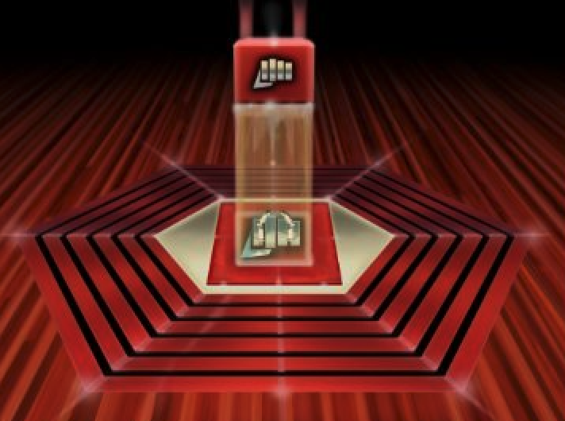

# Coding-Dojo
 

  
  

    An awesome list of katas!
  

## What is a Coding Dojo?

> A Coding Dojo is a meeting where a bunch of coders get together, code, learn, and have fun.
> 
> Emily Bache

## About this Dojo

There are many great websites which contains a lot of problems that can be solved in a codo dojo, however, I didn't find one that really suit my ideas so I created this one. 
I wanted to create a template for coding katas that are easy to use and that´ll take you no time to set it up to your needs or ideas. 

Here's why:
* Your time should be focused on creating something amazing. 
* A project that solves a problem, helps others.
* You shouldn't be doing the same tasks over and over like creating a projects with unit tests from scratch.
* You should element DRY principles to the rest of your life :smile:
* Coding is fun :smile:

I'll be adding more katas in the near future. You may also suggest changes by forking this repo and creating a pull request or opening an issue.

# Sources
Some of the katas displayed in this list are taken from the book

> The Coding Dojo Handbook,
> a practical guide to creating a space where good programmers can become great programmers. By 
> Emily Bache (ISBN 978-91-981180-0-1)

# Kata list

1. [Kata-100-Doors](https://github.com/eduardoperez-ng/Kata-100Doors)
2. [Kata-String-Calculator](https://github.com/eduardoperez-ng/Kata-String-Calculator)
3. [Kata-FizzBuzz](https://github.com/eduardoperez-ng/Kata-FizzBuzz)
4. [Kata-Tennis-Refactoring](https://github.com/eduardoperez-ng/Kata-Tennis-Refactoring)
5. [Kata-PrimeFactors](https://github.com/eduardoperez-ng/Kata-Prime-Factors)
6. [Kata-MVP](https://github.com/eduardoperez-ng/Kata-MVP)
7. [Kata-Yatzy](https://github.com/eduardoperez-ng/Kata-Yatzy)
8. [Kata-Yatzy-Refactoring](https://github.com/eduardoperez-ng/Kata-Yatzy-Refactoring)
9. [Kata-Roman-Numerals](https://github.com/eduardoperez-ng/Kata-Roman-Numerals)
10. [Kata-Health-Bars](https://github.com/eduardoperez-ng/Unity_Health_Bars_With_TDD)
